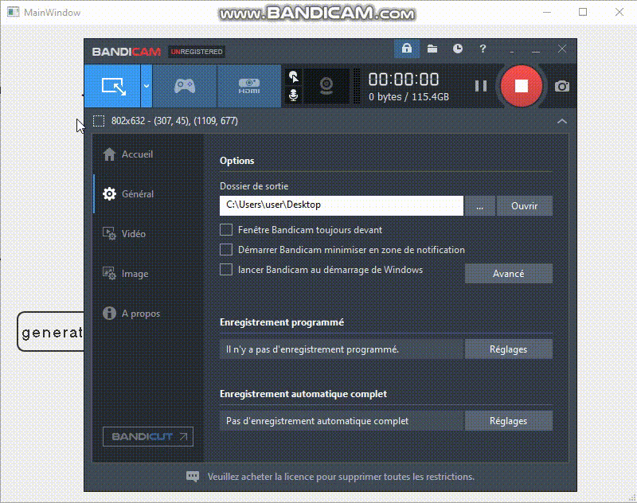

### Password generator and cracker(dictionnary attack and brute-force)
Desktop application made with PyQt (python library).

two parts: 
_ 1st Part: Password generator with different formats that can be used to check regex or for your secret keys 

_Part 2: Hashword Attack Implementation 
* Dictionary attack: Using dictionaries to find a word that matches the hash
* Brute force attack: We try all the combinations of characters to try to find the hashed word in clear 

To use this project you need to run these commands:
 #Install dependencies `pip install -r requirements.txt`  
#Go to app directory `cd App`  
#Run main.py file `py main.py` 
Below a example of this app with some gifs: 

  

